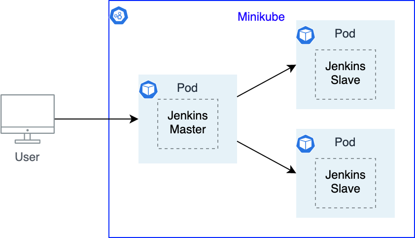

# Jenkins on Kubernetes

This repository shows how to use Jenkins master-slave approach with Kubernetes

Jenkins is an open-source automation server that lets you flexibly orchestrate your build, test, and deployment pipelines. Kubernetes Engine is a hosted version of Kubernetes, a powerful cluster manager and orchestration system for containers
 

## Diagram


Architecture of the presented solution. It makes use of Minikube to run K8s engine, spin up pod for Jenkins master and separated pods for jenkins jobs


## Components
The system consists of
* Docker container which uses open source jenkins container with necessary plugins
* K8s components: Deployment, ClusterRoleBinding and Service
 

## Prerequisites
Following tools need to be installed locally
* minikube
* docker
* kubectl
* java
* jq


## Deployment

To deploy the stack run
```bash
./make-all.sh
```

